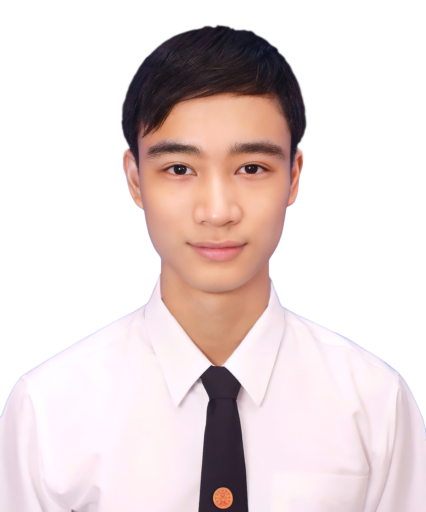
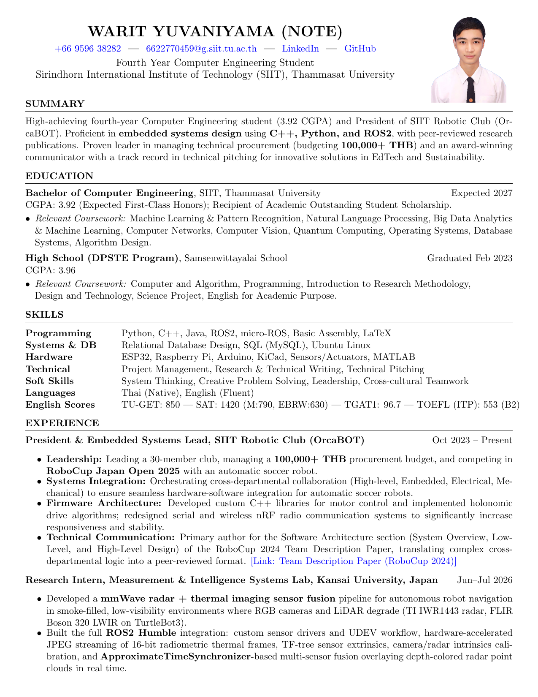
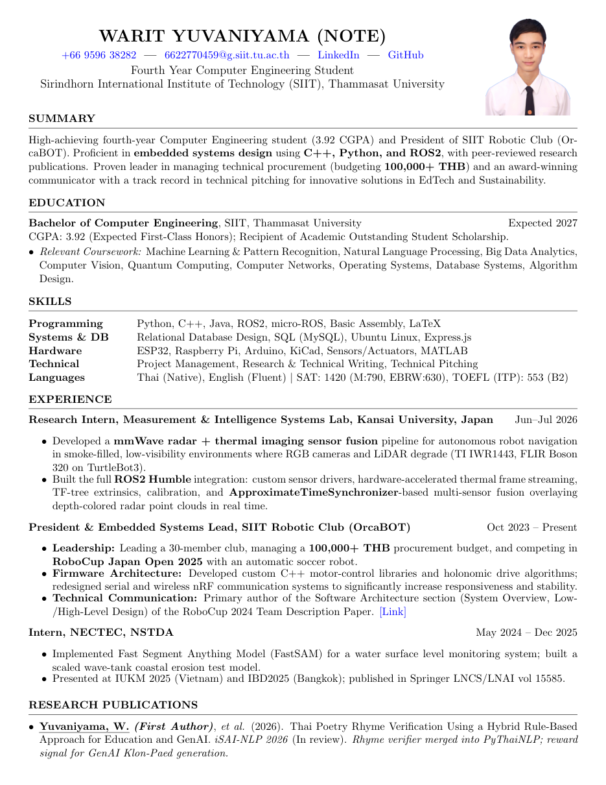

# Warit Yuvaniyama (Note)

  

Fourth-year Computer Engineering student at Sirindhorn International Institute of Technology (SIIT), Thammasat University. CGPA 3.92, recipient of the Academic Outstanding Student Scholarship.

I like exploring many fields, and what keeps me going is seeing the things I build come together. That has taken me across robotics (soccer and rescue robots, in my club, workshops, and internships), a coastal monitoring project, space (fuel planning and the JAXA Kibo mission), classical Thai poetry (I write Klon myself for special occasions, which is where the rhyme verifier came from), and CrystalEyes, a CNC machine I built for 10k THB that does what commercial systems charge 1M+ for. What ties it all together is connecting ideas and knowledge from different fields to make something new and meaningful, and then getting it across to an audience, which is why I usually end up as the presenter and pitcher on my teams.

The biggest of these is OrcaBOT, the SIIT Robotic Club I'm currently President of. Being club president (managing teams, budgets, procurement) and embedded systems lead (communication, control, microcontrollers, the low-level stuff) taught me how much invisible work sits between "we have parts" and "we have a robot." Our team built ours from close to nothing to a functioning machine competing in the Small Size League at RoboCup Japan Open 2025, and I'm really proud of that. I also enjoy the business side of engineering: analyzing problems and turning them into pitches, which has led to a few hackathon and startup competition wins, and I make a point of working across cultures. Some of my closest collaborators are people I first met as strangers at a workshop in another country.

## My CV

Full details are in the documents below. GitHub Actions recompiles them from the LaTeX sources on every push, so what's committed here is current.

| Document | First page | Download |
|---|---|---|
| CV (extended, complete record) |  | [Warit_CV.pdf](Warit_CV.pdf) |
| Resume (1–2 pages) |  | [Resume.pdf](Resume.pdf) |

## Research

**Seeing when cameras can't.** At the Measurement and Intelligence Systems Lab at Kansai University, I built a sensor fusion pipeline combining a TI IWR1443 mmWave radar with a FLIR Boson 320 thermal camera on a TurtleBot3. The goal was navigation in smoke-filled spaces, where RGB cameras and LiDAR both fall over. That meant writing ROS2 drivers, calibrating sensor extrinsics, streaming 16-bit radiometric thermal frames, and fusing everything with ApproximateTimeSynchronizer so radar point clouds could be depth-colored and displayed in real time.

**Thai poetry and NLP.** This grew out of my hobby of reading classical Thai poetry. Our senior project (iSAI-NLP 2026, in review) builds rhyme verification for *Klon-Paed*, and my main part was rewriting [KhaveeVerifier](https://github.com/PyThaiNLP/pythainlp/blob/main/pythainlp/khavee/core.py), PyThaiNLP's rule-based checker: vowel analysis, final-consonant classes, the rhyme test, and silent-letter handling, now merged [into PyThaiNLP 5.3.5](https://github.com/PyThaiNLP/pythainlp/pull/1453) as the default. On that base we added a G2P override dictionary of 4,000+ entries and compared five configurations on 36,475 stanzas (145,709 rhyme checks). It's also [live as a web tool](https://klon-pad-rhyme-checker.streamlit.app/), and a deterministic checker like this works as a reward signal for training models to compose Klon.

**Learning-based control.** Two current projects: physics-informed reward shaping for fuel-efficient orbital transfer with PPO (about 10% less peak fuel, IEICE Transactions on Communications), and online recursive least-squares refinement of legged-locomotion controllers, tested on a Unitree Go2, which brought heading error from 26.3° down to 5.5° (IEEE/SICE SII 2027).

**Environmental monitoring.** With NECTEC, I applied the Fast Segment Anything Model to water surface level estimation for coastal monitoring. This was published in Springer LNCS vol. 15585 (IUKM 2025) and presented in Vietnam and Bangkok.

The full publication list is in the [CV](Warit_CV.pdf).

## Robotics

OrcaBOT competes in the RoboCup Small Size League, which means a team of autonomous soccer robots where embedded software, electrical, and mechanical work all have to line up. As President and Embedded Systems Lead, I coordinate across those four departments, manage a procurement budget of over 100,000 THB, and have personally written the low-level side: custom C++ motor-control libraries, holonomic drive algorithms, and a reworked serial and nRF wireless communication stack. I also wrote the software architecture section of our [RoboCup 2024 Team Description Paper](https://ssl.robocup.org/wp-content/uploads/2024/04/2024_TDP_OrcaBOT.pdf).

## Startups and projects

- **[FlashLight](https://flashlight.in.th)**: co-founder. A study-planning platform that breaks 368+ A-Level topics into daily missions for students preparing for the TCAS admission exam. We reached the Top 5 of 80+ teams in the Startup Thailand League, and our iOS MVP ranked #7 in Education on the Thai App Store.
- **CrystalEyes**: a CNC-based digital microscope system costing 10k–15k THB to build, which automates crystallization screening that commercial systems charge over 1M THB for. I've been building and iterating it since high school; it has been demonstrated on lysozyme growth and MOF studies.
- **Autolocate**: a condo parking management backend in SQL and Express.js, with a three-tier connection pool for role-based access control and JWT authentication over HttpOnly cookies. [Source on GitHub](https://github.com/Warit-Yuv/Autolocate_Backend).
- **CareAir**: a proof-of-concept carbon capture machine for classrooms. First place in the Physical Wellness Track at Thammasat Hackathon: Future Wellness 2024.

## Around the world

Some of this work has taken me abroad. The two-month research internship at Kansai University in Japan was the deepest stretch: I joined the Measurement and Intelligence Systems Lab full-time and shipped the radar-thermal fusion pipeline described above. Before that, I was a workshop participant and later a staff member at the OIT-SIIT international PBL workshops in Osaka (the second one in a staff role, handling logistics and mentoring for the rescue-robot track), and I spent eight days at Taipei Tech building an autonomous vehicle in a team drawn from twelve universities. The conference side brought presentations in Vietnam (IUKM 2025) and Bangkok, and Singapore hosted a sustainability startathon where we were finalists. Moving between these environments, I've gotten used to working with people across languages and time zones, and it's one of the parts of this work I value most.

## Contact

- Email: [6622770459@g.siit.tu.ac.th](mailto:6622770459@g.siit.tu.ac.th)
- LinkedIn: [warit-yuvaniyama](https://www.linkedin.com/in/warit-yuvaniyama/)
- GitHub: [@Warit-Yuv](https://github.com/Warit-Yuv)

---

## About this repository

- `Warit_CV.tex` and `Resume.tex` are the LaTeX sources. The document class, [`resume.cls`](resume.cls), is based on Trey Hunner's resume class.
- [.github/workflows/build.yml](.github/workflows/build.yml) compiles both documents with GitHub Actions and commits the updated PDFs and preview images (in `assets/`) automatically. You don't need to rebuild anything manually.
- To build locally: `pdflatex -interaction=nonstopmode Warit_CV.tex`

## License

The contents of this repository are under the [MIT License](LICENSE). The `resume.cls` template keeps its original notice (© Trey Hunner).